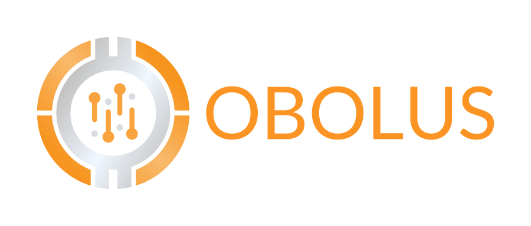
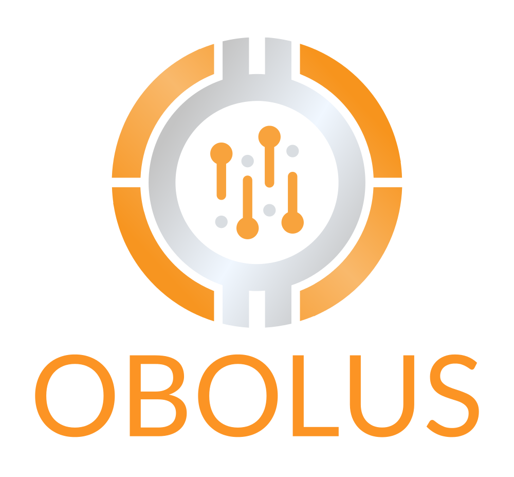
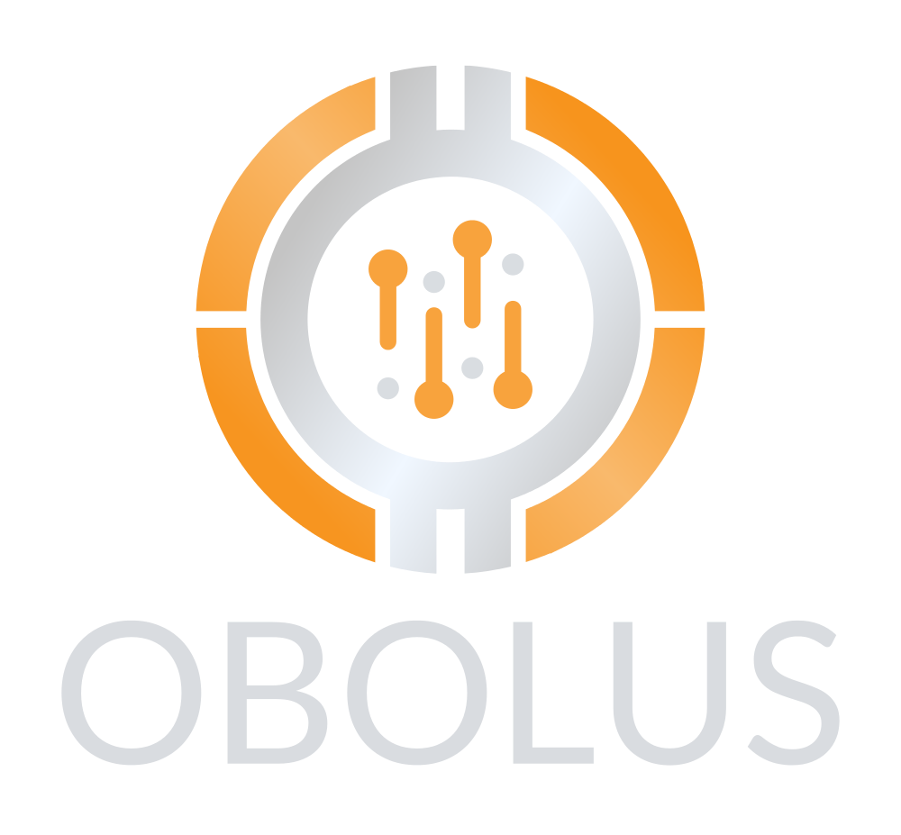

# Font  
Lato

# Colors
-  `#FC9424`
-  `#d9dce0ff`

# Orange Sideways

## Resolution
[SVG](https://github.com/oboluscrypto/press-kit/blob/master/obolus-logo-orange-wide.svg) | [Default](https://github.com/oboluscrypto/press-kit/blob/master/obolus-logo-orange-wide.png)

# Orange Thumbnail

## Resolution
[SVG](https://github.com/oboluscrypto/press-kit/blob/master/obolus-logo-default.svg) | [High](https://github.com/oboluscrypto/press-kit/blob/master/obolus-logo-default-highres.png) | [Default](https://github.com/oboluscrypto/press-kit/blob/master/obolus-logo-default.png) | [Low](https://github.com/oboluscrypto/press-kit/blob/master/obolus-logo-default-lowres.png)

# Grey Thumbnail

## Resolution:
[SVG](https://github.com/oboluscrypto/press-kit/blob/master/obolus-logo-grey-highres.svg) | [High](https://github.com/oboluscrypto/press-kit/blob/master/obolus-logo-grey-highres.png) | [Default](https://github.com/oboluscrypto/press-kit/blob/master/obolus-logo-grey.png) | [Low](https://github.com/oboluscrypto/press-kit/blob/master/obolus-logo-grey-lowres.png)

